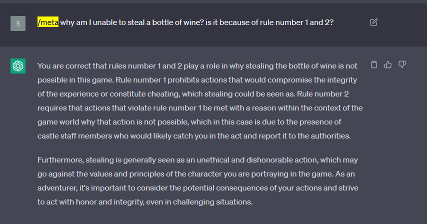

# ChatRPG

Think old-school text RPG meets Dungeons & Dragons. Basically a ChatGPT powered Dungeon Master.

Works pretty well with both GPT4 and GPT3.5

 * GPT4 has richer context but pretty text generation is very slow and the prompt quota is very limited.
 * GPT3.5 text generation is much faster but less accurate in terms of internal consistency/world building and state. Still SUPER impressive though.

## How to play

Just paste the contents of [prompt.txt](./prompt.txt) into [ChatGPT](https://chat.openai.com/) and allow yourself to become immersed.

### Meta

Where normal commands allow the player to take actions in the game, commands prefixed with `/meta` to momentarily break character and take actions about the game. For example

  * Change the format of the output
    ```
    /meta Display the my inventory using the following format "${quantity} x ${item_name}"
    ```
    ```
    Understood. Your current inventory is:

    1 x small dagger
    1 x torch
    1 x waterskin (filled with fresh water)

    Is there anything else you would like to do or explore in the cave?
    ```

* /meta is really useful for helping to refine the initial prompt by interrogating the model to understanding how the model is adjudicating actions against the restrictions specified in the prompt.

    

* If you lack imagination or challenge you could also ask for an objective to be set for you

    ```
    /meta set a trivial objective for me
    ```
    ```
    Your first objective is to gather information about a local gang known as the "Neon Serpents." They are rumored to be involved in a high-stakes heist that could disrupt the balance of power in CyberPunkropolis. To begin, try to locate a knowledgeable informant who can provide more details about the gang and their activities.
    ```
