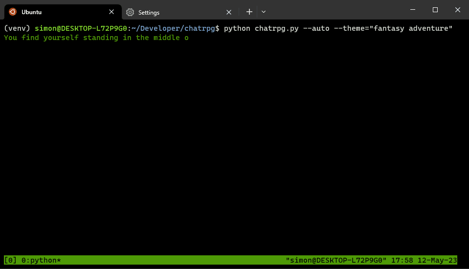

# ChatRPG

Think old-school text RPG meets Dungeons & Dragons. Basically a ChatGPT powered Dungeon Master.



Works pretty well with both GPT4 and GPT3.5

 * GPT4 has richer context but pretty text generation is very slow and the prompt quota is very limited.
 * GPT3.5 text generation is much faster but less accurate in terms of internal consistency/world building and state. Still SUPER impressive though.

## How to play

### In the browser

 * Just paste the contents of [prompt.txt](./prompt.txt) into [ChatGPT](https://chat.openai.com/) and allow yourself to become immersed.

### In a text based terminal console

1. Clone the repo and install the dependencies in a virtual environment

    ```bash
    git clone https://github.com/iokiwi/ChatRPG.git
    cd ChatRPG
    python3 -m venv venv
    source venv/bin/activate
    pip install -r requirements.txt
    ```

 2. Get yourself an OpenAI account
 3. Find your organization ID (https://platform.openai.com/account/org-settings)
 4. Create an API key (https://platform.openai.com/account/api-keys)
 5. Populate your environment with your id and key
    ```bash
    cat << EOF > .env
    OPENAI_API_KEY="<your api key>"
    OPENAI_ORGANIZATION="<your organization>"
    EOF
    ```
 6. Start the game
    ```bash
    python chatrpg.py
    ```

### Automatic Mode

Okay...so you've played dozens of RPG's and your getting bored...why not automate it all.

Use the `--auto` flag to have AI play the game as well.

```bash
python chatrpg.py --auto
```

### More Options

```
usage: chatrpg.py [-h] [--auto] [--theme THEME] [--model MODEL] [--player-model PLAYER_MODEL] [--game-model GAME_MODEL]

options:
  -h, --help            show this help message and exit
  --auto                Have an AI play the game for you.
  --theme THEME         The theme for the RPG
  --model MODEL         Set the AI Model used for the player and game AIs. For information about available models see https://platform.openai.com/docs/models/model-endpoint-compatibility
  --player-model PLAYER_MODEL
                        Set the AI Model used for the player AI. Overrides --model
  --game-model GAME_MODEL
                        Set the AI Model used for the game AI. Overrides --model
```
